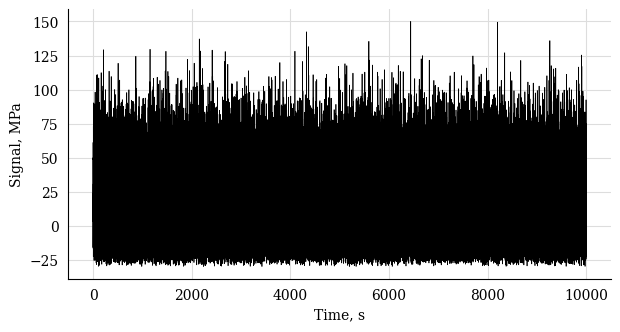
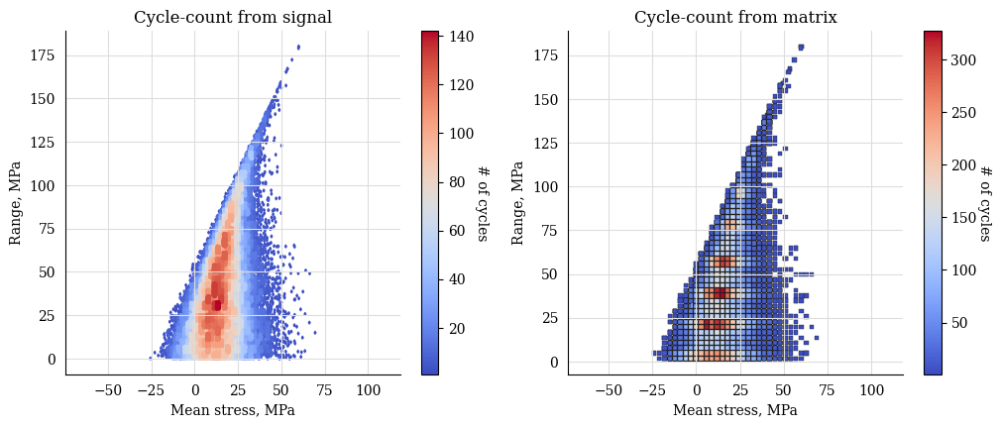
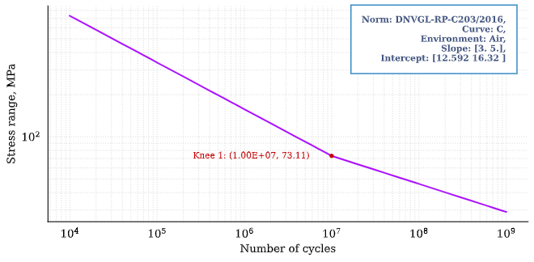
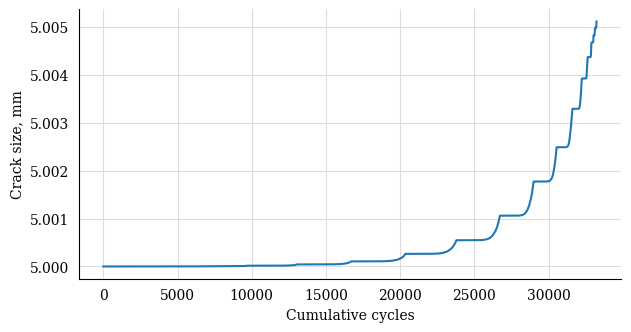

Beginners' guide
================

Welcome to the absolute beginner's guide to py-fatigue! If you have comments or
suggestions, please don't hesitate to file an issue or make a pull request on
our GitHub repo: **https://github.com/OWI-Lab/py_fatigue/**.

Welcome to py-fatigue!
----------------------

py-fatigue was originally part of the DYNAwind suite of tools for wind
turbine structural health monitoring and analysis. The tool has been detached
from the project and now relies on the following PyPi packages only:

- `numpy`
- `plotly`
- `pandas`
- `numba` vers. ^0.56
- `matplotlib` vers. ^3.5
- `pydantic`

The package bundles the main functionality for performing cyclic stress
(fatigue and crack growth) analysis and cycle-counting.

Installing py-fatigue
---------------------

py-fatigue is freely available on GitHub and gets maintained through CI/CD phylosophy. The package requires Python 3.8 or higher, and it requires a 64-bit version of Python.

To install the toolbox, simply run:
    
.. code-block:: bash

    pip install py-fatigue

and you will get the latest stable version of the toolbox.

How to import py-fatigue
------------------------

To access py-fatigue and its functions import it in your Python code like this:

.. code-block:: python

    import py_fatigue as pf

How to use py-fatigue
---------------------

The main functionality of py-fatigue is to perform cyclic stress analysis and
cycle counting. The toolbox provides a number of functions to perform these
tasks. The main functions are:

1. `cycle_count`: collects all the functions related with cycle-counting fatigue data and allows a simpler representation of a rainflow-counted stress vs. time history.
2. `material`: allows the definition of some fatigue-specific material properties such as 

  a. :term:`SN curve<SN Curve>` and
  b. :term:`Paris' law`.

3. `geometry`: enables the instantiation of specific crack geometries for crack propagation analysis, i.e.

  a. Infinite surface.
  b. Hollow cylinder with a crack on its external surface.

4. `damage`: the module collecting the fatigue life calculation models.

  a. `stress-life`: fatigue analysis based on the :term:`cycle-counting<Cycle-counting>` and :term:`SN curve<SN Curve>`.
  b. `crack_growth`: crack propagation (growth) analysis based on  the :term:`cycle-counting<Cycle-counting>`, the :term:`Paris' law` and the geometrical definition of a crack case (defect geometry and medium).

The toolbox also provides a number of helper functions to simulate load
histories:

-   `testing` includes functions to simulate different kinds of load histories. The most generic type of load history can be simulated using the `make_random_signal` function which outputs a `dw_signal.Signal` object.

Example
-------

In the following example, starting from a randomly generated signal, we will:

- calculate the rainflow
- export the cycle-count matrix
- reconstruct the CycleCount object from the exported matrix
- define the SN curve
- calculate the Palmgren-Miner damage
- define the Paris' law
- define a crack geometry
- run a crack growth analysis.

The damage and crack growth analyses will be also executed by means of
the pandas DataFrame accessors that `py-fatigue` implements.

Random signal simulation
~~~~~~~~~~~~~~~~~~~~~~~~

.. code-block:: python

  import py_fatigue as pf
  import py_fatigue.testing as test

  # Simulate a random signal
  t = test.get_sampled_time(duration=10000, fs=10)
  s = test.get_random_data(
      t=t, min_=-30, range_=180, random_type="weibull", a=2., seed=42
  )
  # Plot the signal
  plt.plot(t, s, 'k', lw=0.5)
  plt.xlabel("Time, s")
  plt.ylabel("Signal, MPa")
  plt.show()

Cycle-count definition
~~~~~~~~~~~~~~~~~~~~~~

.. code-block:: python

  # CycleCount definition
  cycle_count = pf.CycleCount.from_timeseries(
      time=t, data=s, mean_bin_width=3., range_bin_width=3.,
  )
  cycle_count

.. table:: 

    ================================= ================ === === === === === === === === 
    Cycle counting object             Random signal                                   
    ================================= ================ === === === === === === === === 
    largest full stress range, MPa    179.026964                                 
    largest stress range, MPa         180.0                                            
    number of full cycles             33317                                            
    number of residuals               23                                              
    number of small cycles            0                                               
    stress concentration factor       N/A                                             
    residuals resolved                False                                           
    mean stress-corrected             No                                              
    ================================= ================ === === === === === === === === 

Cycle-count matrix
~~~~~~~~~~~~~~~~~~

.. code-block:: python

  # Exporting the cycle-count matrix in the legacy format, i.e. not 
  # accounting for mean stresses. This function has been kept for
  # backwards compatibility.
  exp_dict_legacy = cycle_count.as_dict(
      max_consecutive_zeros=20, damage_tolerance_for_binning=0.2, legacy=True
  )
  print(exp_dict_legacy)

.. code-block:: python

  {"nr_small_cycles": 99, "range_bin_lower_bound": 0.2, "range_bin_width": 3.0,
   "hist": [1346.0, 1485.0, 1433.0, 1397.0, 1455.0, 1493.0, 1479.0, 1471.0, 1348.0,
            1432.0, 1361.0, 1234.0, 1236.0, 1203.0, 1146.0, 1103.0, 1072.0,  983.0,
             957.0,  853.0,  808.0,  806.0,  679.0,  659.0,  570.0,  520.0,  449.0,
             451.0,  397.0,  376.0,  289.0,  259.0,  236.0,  237.0,  164.0,  160.0,
             120.0,   89.0,   85.0,   92.0,   60.0,   54.0,   39.0,   20.0,   24.0,
              24.0,   17.0,   12.0,   10.0,    8.0,    2.0,    5.0,    6.0,    1.0,
               0.0,    2.0,    0.0,    1.0,    0.0,    1.0], "lg_c": [],
   "res": [ 64.9527,  76.1706,  83.8523, 112.9550, 115.8100, 123.7286, 125.4990,
           137.6065, 138.7786, 139.5674, 140.8493, 159.0391, 159.1209, 167.0853,
           167.1570, 180.0000, 179.8804, 122.3010, 115.1474,  58.9131,  53.7620,
            31.8885],
   "res_sig": [ 49.8674, -15.0853,  61.0853, -22.7670,  90.1880, -25.6220,  98.1066,
               -27.3924, 110.2141, -28.5645, 111.0029, -29.8464, 129.1926, -29.9283,
               137.157,  -30.0000, 150.0000, -29.8804,  92.4207, -22.7267,  36.1864,
               -17.5756, 14.3128, 14.2784]}

.. code-block:: python

  # Exporting the cycle-count matrix
  exp_dict = cycle_count.as_dict(
      max_consecutive_zeros=20, damage_tolerance_for_binning=1
  )
  print(exp_dict)

.. code-block:: python

  {"nr_small_cycles": 99, "range_bin_lower_bound": 0.2, "range_bin_width": 3.0,
   "mean_bin_lower_bound": -25.5, "mean_bin_width": 3.0,
   "hist": [[ 0.0,  1.0],
            [ 1.0,  1.0],
            [ 4.0,  5.0,  4.0,  1.0,  3.0], 
            [14.0, 17.0,  9.0, 10.0,  6.0,  4.0,  0.0,  2.0,  1.0],
            [31.0, 31.0, 21.0, 20.0, 13.0, 10.0,  6.0,  7.0,  4.0,  5.0],
            [33.0, 51.0, 24.0, 39.0, 31.0, 28.0, 22.0, 15.0, 13.0,  6.0,  2.0,  3.0,
             1.0],
            [56.0, 68.0, 63.0, 40.0, 45.0, 40.0, 36.0, 41.0, 19.0, 22.0, 18.0, 11.0,
              7.0,  2.0,  1.0],
            [74.0, 91.0, 78.0, 60.0, 78.0, 60.0, 75.0, 46.0, 44.0, 44.0, 40.0, 20.0,
             19.0, 18.0,  4.0,  2.0],
            ...,
            [ 0.0,  2.0,  0.0,  1.0,  0.0,  0.0,  0.0,  0.0,  1.0,  0.0,  0.0,  0.0,
              1.0,  0.0,  0.0,  0.0,  1.0],
            [ 0.0,  0.0,  0.0,  0.0,  0.0,  0.0,  1.0,  0.0,  0.0,  0.0,  0.0,  0.0,
              0.0,  0.0,  0.0,  0.0,  1.0],
            [0.0,  0.0,  0.0,  0.0,  1.0]],
   "lg_c": [[ 52.7204, 157.4858], [ 52.7330, 165.3195], [ 53.0368, 165.7063],
            [ 56.1889, 172.3578], [ 59.9228, 179.0270]],
   "res": [[  17.3910,  64.9527], [ 23.0000,  76.1706], [19.1591,  83.8523],
           [  33.7105, 112.9550], [ 32.2830, 115.8100], [36.2423, 123.7286],
           [  35.3571, 125.4990], [ 41.4109, 137.6065], [40.8248, 138.7786],
           [  41.2192, 139.5674], [ 40.5782, 140.8493], [49.6731, 159.0391],
           [  49.6322, 159.1209], [ 53.6143, 167.0853], [53.5785, 167.1570],
           [  60.0000, 180.0000], [ 60.0598, 179.8804], [31.2702, 122.3010],
           [  34.8470, 115.1474], [  6.7298,  58.9131], [ 9.3054,  53.7620],
           [  -1.6314, 31.8885]],
   "res_sig": [ 49.8674, -15.0853,  61.0853, -22.7670,  90.1880, -25.6220,  98.1066,
               -27.3924, 110.2141, -28.5645, 111.0029, -29.8464, 129.1926, -29.9283,
               137.1570, -30.0000, 150.0000, -29.8804, 92.4207,  -22.7267,  36.1864,
               -17.5756, 14.3128, 14.2784]}

.. code-block:: python

    # Reconstructing the CycleCount instance from the exported matrix
    cycle_count_d = pf.CycleCount.from_rainflow(exp_dict, name="Random Signal")
    cycle_count_d

.. table:: 

    ================================= ================ === === === === === === === === 
    Cycle counting object             Random Signal                                   
    ================================= ================ === === === === === === === === 
    largest full stress range, MPa    179.027                                          
    largest stress range, MPa         180.0                                            
    number of full cycles             33219                                            
    number of residuals               22                                              
    number of small cycles            99                                              
    stress concentration factor       N/A                                             
    residuals resolved                False             
    mean stress-corrected             No                              
    ================================= ================ === === === === === === === === 

.. code-block:: python

  import matplotlib as mpl
  import matplotlib.pyplot as plt
  fig, axs = plt.subplots(1, 2, figsize=(12, 4.5))
  cycle_count.plot_histogram(fig=fig, ax=axs[0], plot_type="mean-range",
                             marker="d", s=2, cmap=mpl.cm.get_cmap("coolwarm"))
  axs[0].set_title("Cycle-count from signal")
  cycle_count_d.plot_histogram(fig=fig, ax=axs[1], plot_type="mean-range",
                               marker="s", s=10, edgecolors="#222",
                               cmap=mpl.cm.get_cmap("coolwarm"), linewidth=0.25)
  axs[1].set_title("Cycle-count from matrix")
  plt.show()

Stress-Life
~~~~~~~~~~~

SN Curve definition
+++++++++++++++++++

.. code-block:: python

  c_air = pf.SNCurve(
      [3, 5],
      intercept=[12.592, 16.320],
      norm="DNVGL-RP-C203/2016",
      environment='Air',
      curve='C'
  )
  c_air

Damage calculation analysis
+++++++++++++++++++++++++++

.. code-block:: python

    # Calculate damage for the cycle-count objects
    damage = pf.damage.get_pm(cycle_count=cycle_count, sn_curve=c_air)
    damage_d = pf.damage.get_pm(cycle_count=cycle_count_d, sn_curve=c_air)
    print(f"damage from signal: {sum(damage)}")
    print(f"damage from matrix: {sum(damage_d)}")

.. code-block:: bash

  damage from signal: 0.0013318803351252439
  damage from matrix: 0.0013321255571107358

Crack growth
~~~~~~~~~~~~
A crack growth simulation necessitates of three ingredients (objects):

- Cycle-counted stress history
- Crack growth curve (e.g. Paris' law)
- Crack geometry

Paris' curve definition
+++++++++++++++++++++++

.. code-block:: python

  SIF = np.linspace(1,2500, 300)
  SLOPE = np.array([2.88, 5.1, 8.16, 5.1, 2.88])
  INTER = np.array([1E-16, 1E-20, 1E-27, 1E-19, 1E-13])
  THRESHOLD = 20
  CRITICAL = 2000
  pc = pf.ParisCurve(slope=SLOPE, intercept=INTER, threshold=THRESHOLD,
                     critical=CRITICAL, norm="The norm",
                     environment="Environment", curve="nr.")
  pc

Crack geometry definition
+++++++++++++++++++++++++

.. code-block:: python

  geo = pf.geometry.HollowCylinder(
    initial_depth=5.,
    thickness=10.,
    height=30.,
    outer_diameter=30.,
    crack_position="external"
  )
  geo

.. code-block:: python

  HollowCylinder(
    _id=HOL_CYL_01,
    initial_depth=5.0,
    outer_diameter=300.0,
    thickness=10.0,
    height=30.0,
    crack_position=external,
  )

Crack growth analysis
+++++++++++++++++++++

.. code-block:: python

  cg = pf.crack_growth.get_crack_growth(
    cycle_count, pc, geo, express_mode=True
  )
  print(f"Cycles to end: {int(cg.final_cycles)}")

.. code-block:: bash

  Fatigue spectrum applied w/o failure. Stopping calculation
  Cycles to end: 3328

.. code-block:: python

  cg_d = pf.crack_growth.get_crack_growth(
    cycle_count_d, pc, geo, express_mode=True
  )
  print(f"Cycles to end: {int(cg.final_cycles)}")

.. code-block:: bash

  Fatigue spectrum applied w/o failure. Stopping calculation
  Cycles to end: 3320

.. code-block:: python

  plt.plot(np.cumsum(cg_d.count_cycle), cg_d.crack_depth)
  plt.xlabel("Cumulative cycles")
  plt.ylabel("Crack size, mm")
  plt.show()

Working with pandas DataFrames
~~~~~~~~~~~~~~~~~~~~~~~~~~~~~~

It's possible to translate the CycleCount object to a pandas DataFrame and use
the implemented accessors :class:`py_fatigue.damage.stress_life.PalmgrenMiner`
(`miner`) and :class:`py_fatigue.damage.crack_growth.CrackGrowth` (`cg`) to
perform the stress-life and propagation analyses as shown above.

.. code-block:: python

  import pandas as pd

  df = cycle_count.to_df()

  # Stress-life
  df.miner.damage(sn_curve=c_air)
  # Crack-growth
  df.cg.calc_growth(cg_curve=pc, crack_geometry=geo)

.. code-block:: python

  df.miner.plot_histogram()

.. code-block:: python

  df.plot(kind="scatter", x="cumul_cycle", y="crack_depth", s=2)

