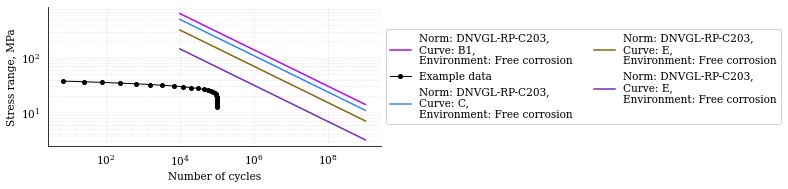

.. _2. SN curve:

2. SN curve
===========

The first reference to the fatigue of metals dates to 1829 when Poncelet, a
French military engineer, used the adjective “tired” to describe steels under
stress and assumed that steel components experience a decrease of durability
when they undergo repeated variable loads. In 1837, the first document in
history relating to a fatigue test was published. The test was recorded by
Albert a German mining administrator, and it was aimed to understand the
causes of the failure of the conveyor chains in the Clausthal mines in 1829.
In 1843, Rankine and York focused their attention on railway axles, thanks to
the establishment of the Her Majesty's Railway Inspectorate instituted because
of the increasing number of accidents, amongst which the so-called Versailles
disaster, where almost 60 people lost their lives because of the failure of the
axle tree of the first engine on 5 October 1842. Anyway, the term fatigue was
coined only in 1854 by the Englishman Braithwite, who discussed the fatigue
failures of multiple components as water pumps, brewery equipment, and of
course, railway axles. Many other English and German studies on the
deterioration of railway axles were made in those years, but the work of
Wöhler, Royal "Obermaschinenmeister" of the "Niederschlesisch-Mährische"
Railways in Frankfurt an der Oder, was the milestone paving the way for the
modern conception of fatigue testing and interpretation of results. In 1858 and
1860, August Wöhler measured, for 22 000 km, the service loads of railway
axles with deflection gages personally developed and from his studies
concluded that “If we estimate the durability of the axles to be 200,000
miles with respect to wear of the journal bearings, it is therefore only
necessary that it withstands 200,000 bending cycles of the magnitude measured
without failure.” Such statement represents the first suggestion for a safe
life design philosophy with retirement time (or distance travelled). Wöhler
then calculated the stresses deriving from service loads and concluded that
the higher the stress amplitude is, the more detrimental influence on the
axle will be, plus a tensile mean stress anticipates the rupture.
Furthermore, he even stated that a replacement of the axle would have been
necessary if radial flaws propagated up to 20 mm into the material, and this
procedure could be interpreted as an ancestor of the flaw tolerant safe life
methodology. Anyway, test results of Wöhler were tabulated and not plotted
until 1875, when Spangenberg adopted unusual linear axes to present these
data. Furthermore, stress versus number of cycles (S/N) curves were addressed
as Wöhler curves only in 1936 by Kloth and Stroppel. The idea to plot many
fatigue test data, including the 60-year-old experiments of Wöhler, in
logarithmic axes and interpolate them with a power law is from 1910 by
Basquin. The equation relating maximum or alternate stress with the number of
cycles is

.. math:: 

    N \cdot \left( \Delta \sigma \right)^m = \bar{a}

where:

- :math:`N` = predicted number of cycles to failure for stress range Δσ;
- :math:`\Delta \sigma` = stress range with unit MPa;
- :math:`m` = negative inverse slope of S-N curve;
- :math:`\log \left( \bar{a} \right)` = intercept of log N-axis by S-N curve.

a. Multiple SN curves
---------------------

.. note::
    In this example we define four SN curves for free corrosion as per 
    `DNVGL-RP-C203 <shorturl.at/ipBKL>`_ and plot them using
    `matplotlib <https://matplotlib.org>`_ and `plotly <https://plotly.com>`_. 
    We additionally define a random gaussian stress range-cycles history to 
    plot against the SN curves defined.

.. code-block:: python
    :linenos:

    #SN curves definition
    b1_c = sn.SNCurve(
        slope=3,                       # SNCurve can handle multiple slope and
        intercept=12.436,              # intercept types, as long as their sizes 
        norm='DNVGL-RP-C203',          # are compatible. The slope and intercept 
        environment='Free corrosion',  # attribute will be stored as numpy arrays.
        curve='B1'
    )
    c_c = sn.SNCurve(
        [3],
        12.115,
        norm='DNVGL-RP-C203',
        environment='Free corrosion',
        curve='C'
    )
    e_c = sn.SNCurve(
        3,
        intercept=[11.533,],
        norm='DNVGL-RP-C203',
        environment='Free corrosion',
        curve='E'
    )
    w3_c = sn.SNCurve(
        [3],
        intercept=[10.493,],
        norm='DNVGL-RP-C203',
        environment='Free corrosion',
        curve='E'
    )

This check on slopes and intercepts shows that they are alrays stored as numpy
1darrays.

Input:

.. code-block:: python
    :linenos:
    
    print(f'b1_c.slope: {b1_c.slope}, b1_c.intercept: {b1_c.intercept}')
    print('type(b1_c.slope): {0}, type(b1_c.intercept): {1}'.format(
        type(b1_c.slope), type(b1_c.intercept)
        )
    )
    print(f'c_c.slope: {c_c.slope}, c_c.intercept: {c_c.intercept}')
    print('type(c_c.slope): {0}, type(c_c.intercept): {1}'.format(
        type(c_c.slope), type(c_c.intercept)
        )
    )
    print(f'e_c.slope: {e_c.slope}, e_c.intercept: {e_c.intercept}')
    print('type(e_c.slope): {0}, type(e_c.intercept): {1}'.format(
        type(e_c.slope), type(e_c.intercept)
        )
    )
    print(f'w3_c.slope: {w3_c.slope}, w3_c.intercept: {w3_c.intercept}')
    print('type(w3_c.slope): {0}, type(w3_c.intercept): {1}'.format(
        type(w3_c.slope), type(w3_c.intercept)
        )
    )

Output:

.. code-block:: bash

        b1_c.slope: [3], b1_c.intercept: [12.436]
    type(b1_c.slope): <class 'numpy.ndarray'>, type(b1_c.intercept): <class 'numpy.ndarray'>
    c_c.slope: [3], c_c.intercept: [12.115]
    type(c_c.slope): <class 'numpy.ndarray'>, type(c_c.intercept): <class 'numpy.ndarray'>
    e_c.slope: [3], e_c.intercept: [11.533]
    type(e_c.slope): <class 'numpy.ndarray'>, type(e_c.intercept): <class 'numpy.ndarray'>
    w3_c.slope: [3], w3_c.intercept: [10.493]
    type(w3_c.slope): <class 'numpy.ndarray'>, type(w3_c.intercept): <class 'numpy.ndarray'>

Defining a normally distributed fatigue spectrum

.. code-block:: python
    :linenos:
    
    # Seed random number generator
    np.random.seed(1)
    # Generate some integers shifted so that their minimum is certainly >0
    random_nums = np.random.normal(scale=3, size=100000)
    random_ints = np.round(random_nums + 2 * np.max(random_nums))
    bins = np.arange(start=min(random_ints), stop = max(random_ints) + 1)
    hist = np.histogram(
        random_ints,
        bins=bins,
    )
    cycles = hist[0][::-1] # sorted from highest bin to lowest
    cumulative_cycles = np.cumsum(cycles)
    stress_range_bins = ((hist[1][1:] + hist[1][:-1]) / 2)[::-1]

Matplotlib

.. code-block:: python
    :linenos:
    
    #Plot
    fig, ax = b1_c.plot(
        cycles=cumulative_cycles,
        stress_range=stress_range_bins,
        dataset_name="Example data"
    )
    c_c.plot(fig=fig, ax=ax)
    e_c.plot(fig=fig, ax=ax)
    w3_c.plot(fig=fig, ax=ax)
    plt.legend()

Reformat SN curve names for plotly

.. code-block:: python
    :linenos:
    
    b1_c.format_name(html_format=True)
    c_c.format_name( html_format=True)
    e_c.format_name( html_format=True)
    w3_c.format_name(html_format=True)

Plotly

.. code-block:: python
    :linenos:

    # Plot
    data, layout = b1_c.plotly(
        cycles=cumulative_cycles,
        stress_range=stress_range_bins,
        dataset_name="Example data"
    )
    data.extend(c_c.plotly()[0])
    data.extend(e_c.plotly()[0])
    data.extend(w3_c.plotly()[0])
    fig = go.Figure(data=data, layout=layout)
    fig.show()

b. SN curves methods
--------------------

.. note::

    In this example we define two SN curves and we will see how the following
    methods work:

    * get_cycles()
    * get_stress()
    * get_knee_cycles()
    * get_knee_stress()

.. code-block:: python
    :linenos:
    
    # SN curve definition
    s = sn.SNCurve([3, 5], [10.970, 13.617], endurance=1e11)

Asking to print the following:

.. code-block:: python
    :linenos:
    
    # prints
    print(s.get_cycles(100))  # Get nr of cycles for stress_range = 100 MPa
    print(s.get_stress(1E6))  # Get nr of cycles for 1 million cycles
    print(s.get_knee_cycles())  # Get nr of cycles where there is/are knee(s)
    print(s.get_knee_stress())  # Get stress(es) where there is/are knee(s)
    print(s.get_stress(s.endurance))  # Get stress at endurance (1e11 cycles)

Gives:

.. code-block:: bash
    
    93325.43007969948
    45.35933372579283
    [9988493.69936506]
    [21.06201899]
    3.3373365130514894

Asking back the number of cycles at endurance shall return *Inf* instead.

Input:

.. code-block:: python
    :linenos:

    print(s.get_cycles(s.endurance_stress))  # Get cycles at endurance stress.

Output:

.. code-block:: bash
    
    inf