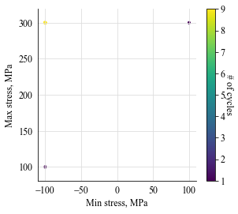
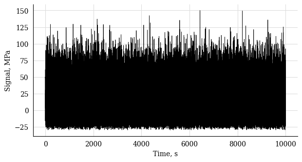
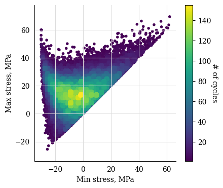
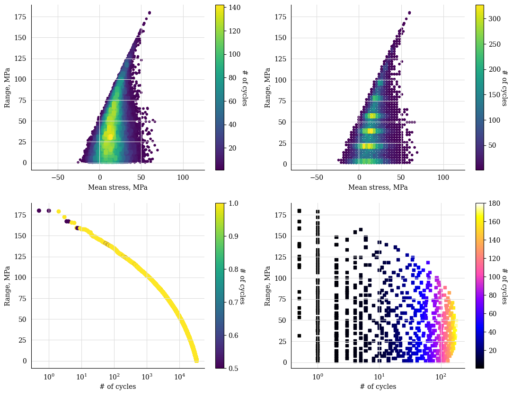

.. _4. CycleCount definition:

4. CycleCount definition
========================

The CycleCount class incorporates the main information about a 
processed signal for fatigue analysis.

a. Constant signal
------------------

.. note::
    In this example we define a fatigue stress signal in the form
    of a sinusoidal function.

    We then feed our signal to the :class:`~CycleCount` class.

Define the time and stress arrays

.. code-block:: python

    t = np.arange(0, 10.1, 0.1)  # (in seconds)
    s = 200 * np.sin(np.pi*t) + 100   # (in MPa)
    plt.plot(t, s)
    plt.xlabel("time, s")
    plt.ylabel("stress, MPa")
    plt.show()

.. image:: ../../_static/_img/sine_wave.png

Define the CycleCount instance

.. code-block:: python
    
    cc = pf.CycleCount.from_timeseries(s, t, name="Example")
    cc

.. list-table:: CycleCount from constant time series
    :widths: 25 25
    :header-rows: 2

    * - 
      - Example
    * - Cycle counting object 
      -  
    * - largest full stress range, MPa,
      -  None
    * - largest stress range, MPa	
      - 400.0
    * - number of full cycles
      - 0
    * - number of residuals
      - 11
    * - number of small cycles
      - 0
    * - stress concentration factor
      - N/A
    * - residuals resolved
      - False
    * - mean stress-corrected
      - No

.. code-block:: python

    fig, ax = plt.subplots(1,1, figsize=(4.5, 4))
    cc.plot_histogram(fig=fig)

Showing the exported dictionary

.. code-block:: python

    cc.as_dict(legacy_expoprt=True)

Gives:

.. code-block:: bash

    {
        'nr_small_cycles': 0,
        'range_bin_lower_bound': 0.2,
        'range_bin_width': 0.05,
        'hist': [],
        'lg_c': [],
        'res': [200.0, 400.0, 400.0, 400.0, 400.0, 400.0,
                400.0, 400.0, 400.0, 400.0, 200.0],
        'res_sig': [100.0, 300.0, -100.0, 300.0, -100.0, 300.0, 
                   -100.0, 300.0, -100.0, 300.0, -100.0, 100.0]
    }

b. Weibull-distributed signal
-----------------------------

.. note::
    In this example we define a Weibull-distributed fatigue stress signal.
    
    :class:`~CycleCount` class.

Define the time and stress arrays

.. code-block:: python
    
  import py_fatigue.testing as test

  # Simulate a random signal
  t = test.get_sampled_time(duration=10000, fs=10)
  s = test.get_random_data(
    t=t, min_=-30, range_=180, random_type="weibull", a=2., seed=42
  )
  # Plot the signal
  plt.plot(t, s, 'k', lw=0.5)
  plt.xlabel("Time, s")
  plt.ylabel("Signal, MPa")
  plt.show()

Define the CycleCount instance

.. code-block:: python
    
    # CycleCount definition
  cycle_count = pf.CycleCount.from_timeseries(
    time=t, data=s, mean_bin_width=3., range_bin_width=3.,
  )
  cycle_count

.. table:: 

  ================================= ================ === === === === === === === === 
  Cycle counting object             Random signal                                   
  ================================= ================ === === === === === === === === 
  largest full stress range, MPa    179.026964                                 
  largest stress range, MPa         180.0                                            
  number of full cycles             33317                                            
  number of residuals               23                                              
  number of small cycles            0                                               
  stress concentration factor       N/A                                             
  residuals resolved                False                                           
  mean stress-corrected             No                                              
  ================================= ================ === === === === === === === === 

.. code-block:: python

    fig, ax = plt.subplots(1,1, figsize=(4.5, 4))
    cc.plot_histogram(fig=fig)

Exporting the rainflow counted signal as a json dictionary, both in legacy
(no mean stress) and new format.

.. code-block:: python

  # Exporting the cycle-count matrix in the legacy format, i.e. not 
  # accounting for mean stresses. This function has been kept for
  # backwards compatibility.
  exp_dict_legacy = cycle_count.as_dict(
      max_consecutive_zeros=20, damage_tolerance_for_binning=0.2, legacy=True
  )
  print(exp_dict_legacy)

.. code-block:: python

  {"nr_small_cycles": 99, "range_bin_lower_bound": 0.2, "range_bin_width": 3.0,
   "hist": [1346.0, 1485.0, 1433.0, 1397.0, 1455.0, 1493.0, 1479.0, 1471.0, 1348.0,
            1432.0, 1361.0, 1234.0, 1236.0, 1203.0, 1146.0, 1103.0, 1072.0,  983.0,
             957.0,  853.0,  808.0,  806.0,  679.0,  659.0,  570.0,  520.0,  449.0,
             451.0,  397.0,  376.0,  289.0,  259.0,  236.0,  237.0,  164.0,  160.0,
             120.0,   89.0,   85.0,   92.0,   60.0,   54.0,   39.0,   20.0,   24.0,
              24.0,   17.0,   12.0,   10.0,    8.0,    2.0,    5.0,    6.0,    1.0,
               0.0,    2.0,    0.0,    1.0,    0.0,    1.0], "lg_c": [],
   "res": [ 64.9527,  76.1706,  83.8523, 112.9550, 115.8100, 123.7286, 125.4990,
           137.6065, 138.7786, 139.5674, 140.8493, 159.0391, 159.1209, 167.0853,
           167.1570, 180.0000, 179.8804, 122.3010, 115.1474,  58.9131,  53.7620,
            31.8885],
   "res_sig": [ 49.8674, -15.0853,  61.0853, -22.7670,  90.1880, -25.6220,  98.1066,
               -27.3924, 110.2141, -28.5645, 111.0029, -29.8464, 129.1926, -29.9283,
               137.157,  -30.0000, 150.0000, -29.8804,  92.4207, -22.7267,  36.1864,
               -17.5756, 14.3128, 14.2784]}

.. code-block:: python

  # Exporting the cycle-count matrix
  exp_dict = cycle_count.as_dict(
      max_consecutive_zeros=20, damage_tolerance_for_binning=1
  )
  print(exp_dict)

.. code-block:: python

  {"nr_small_cycles": 99, "range_bin_lower_bound": 0.2, "range_bin_width": 3.0,
   "mean_bin_lower_bound": -25.5, "mean_bin_width": 3.0,
   "hist": [[ 0.0,  1.0],
            [ 1.0,  1.0],
            [ 4.0,  5.0,  4.0,  1.0,  3.0], 
            [14.0, 17.0,  9.0, 10.0,  6.0,  4.0,  0.0,  2.0,  1.0],
            [31.0, 31.0, 21.0, 20.0, 13.0, 10.0,  6.0,  7.0,  4.0,  5.0],
            [33.0, 51.0, 24.0, 39.0, 31.0, 28.0, 22.0, 15.0, 13.0,  6.0,  2.0,  3.0,
             1.0],
            [56.0, 68.0, 63.0, 40.0, 45.0, 40.0, 36.0, 41.0, 19.0, 22.0, 18.0, 11.0,
              7.0,  2.0,  1.0],
            [74.0, 91.0, 78.0, 60.0, 78.0, 60.0, 75.0, 46.0, 44.0, 44.0, 40.0, 20.0,
             19.0, 18.0,  4.0,  2.0],
            ...,
            [ 0.0,  2.0,  0.0,  1.0,  0.0,  0.0,  0.0,  0.0,  1.0,  0.0,  0.0,  0.0,
              1.0,  0.0,  0.0,  0.0,  1.0],
            [ 0.0,  0.0,  0.0,  0.0,  0.0,  0.0,  1.0,  0.0,  0.0,  0.0,  0.0,  0.0,
              0.0,  0.0,  0.0,  0.0,  1.0],
            [0.0,  0.0,  0.0,  0.0,  1.0]],
   "lg_c": [[ 52.7204, 157.4858], [ 52.7330, 165.3195], [ 53.0368, 165.7063],
            [ 56.1889, 172.3578], [ 59.9228, 179.0270]],
   "res": [[  17.3910,  64.9527], [ 23.0000,  76.1706], [19.1591,  83.8523],
           [  33.7105, 112.9550], [ 32.2830, 115.8100], [36.2423, 123.7286],
           [  35.3571, 125.4990], [ 41.4109, 137.6065], [40.8248, 138.7786],
           [  41.2192, 139.5674], [ 40.5782, 140.8493], [49.6731, 159.0391],
           [  49.6322, 159.1209], [ 53.6143, 167.0853], [53.5785, 167.1570],
           [  60.0000, 180.0000], [ 60.0598, 179.8804], [31.2702, 122.3010],
           [  34.8470, 115.1474], [  6.7298,  58.9131], [ 9.3054,  53.7620],
           [  -1.6314, 31.8885]],
   "res_sig": [ 49.8674, -15.0853,  61.0853, -22.7670,  90.1880, -25.6220,  98.1066,
               -27.3924, 110.2141, -28.5645, 111.0029, -29.8464, 129.1926, -29.9283,
               137.1570, -30.0000, 150.0000, -29.8804, 92.4207,  -22.7267,  36.1864,
               -17.5756, 14.3128, 14.2784]}

It is also possible defining the CycleCount instance from the exported
CycleCount dictionary (json file).

.. code-block:: python

    # Reconstructing the CycleCount instance from the exported matrix
    cycle_count_d = pf.CycleCount.from_rainflow(exp_dict, name="Random Signal")
    cycle_count_d

.. table:: 

    ================================= ================ === === === === === === === === 
    Cycle counting object             Random Signal                                   
    ================================= ================ === === === === === === === === 
    largest full stress range, MPa    179.027                                          
    largest stress range, MPa         180.0                                            
    number of full cycles             33219                                            
    number of residuals               22                                              
    number of small cycles            99                                              
    stress concentration factor       N/A                                             
    residuals resolved                False             
    mean stress-corrected             No                              
    ================================= ================ === === === === === === === === 

A slightly more complicated plot to show the Markov matrix as well as
the cumulative (or non-cumulative) rainflow matric both for `cc` and `cc_dct`:

.. code-block:: python
    
    fig, axs = plt.subplots(2,2, figsize=(13, 10))
    cc.plot_histogram(fig=fig, ax=axs[0][0], plot_type="mean-range")
    cc_dct.plot_histogram(fig=fig, ax=axs[0][1], plot_type="mean-range")
    cc.plot_histogram(fig=fig, ax=axs[1][0], plot_type="counts-range-cumsum", s=30)
    cc_dct.plot_histogram(fig=fig, ax=axs[1][1], plot_type="counts-range",
                          marker='s', s=20,
                          cmap=matplotlib.cm.get_cmap("gnuplot2"))  # chg cmap
    axs[1][1].set_xscale("log")
    axs[1][0].set_xscale("log")
    plt.show()

  Comparison of histograms built from signal and from its cycle-count matrix

.. .. image:: ../../_static/_img/hist_from_weib_signal_comparisons.png
